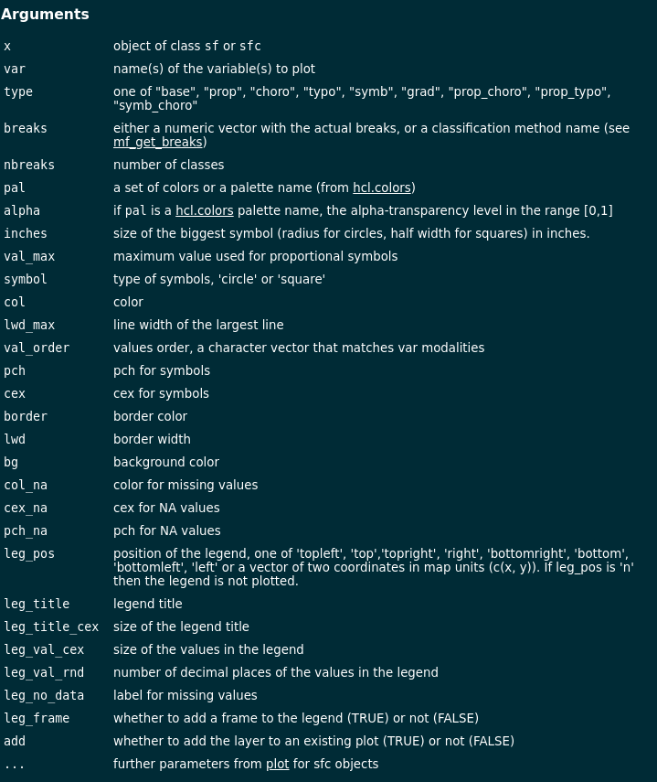
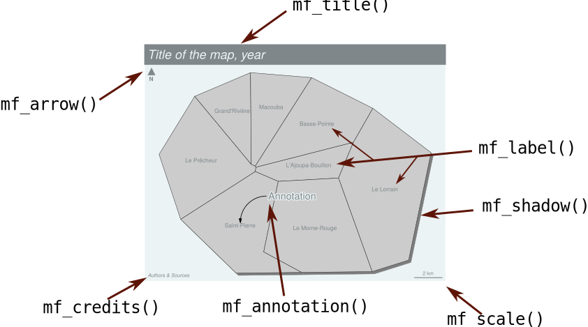
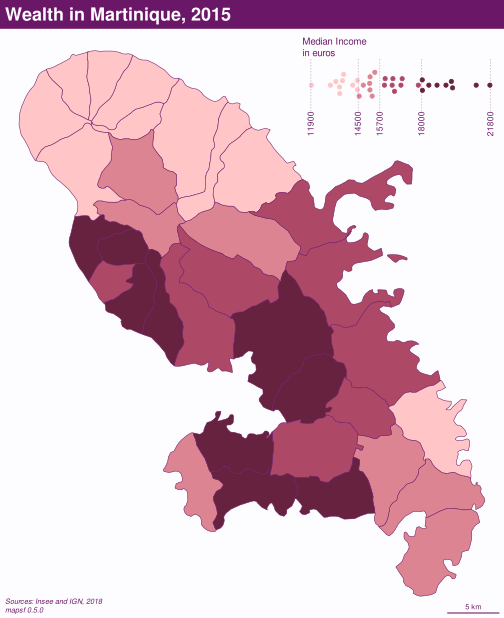
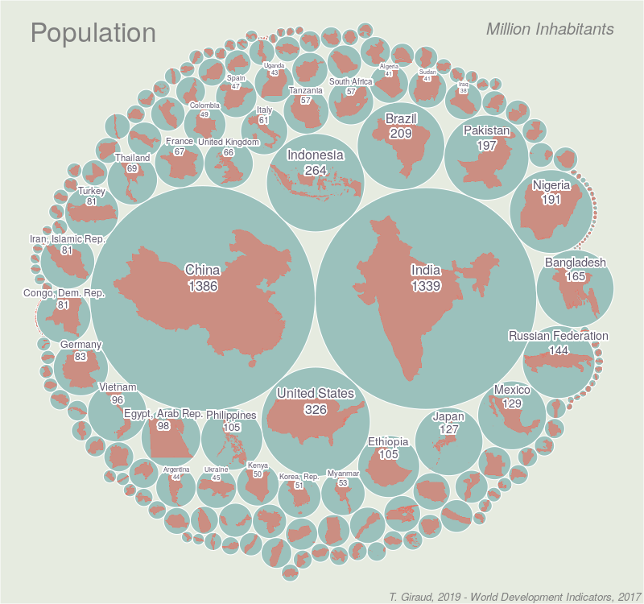
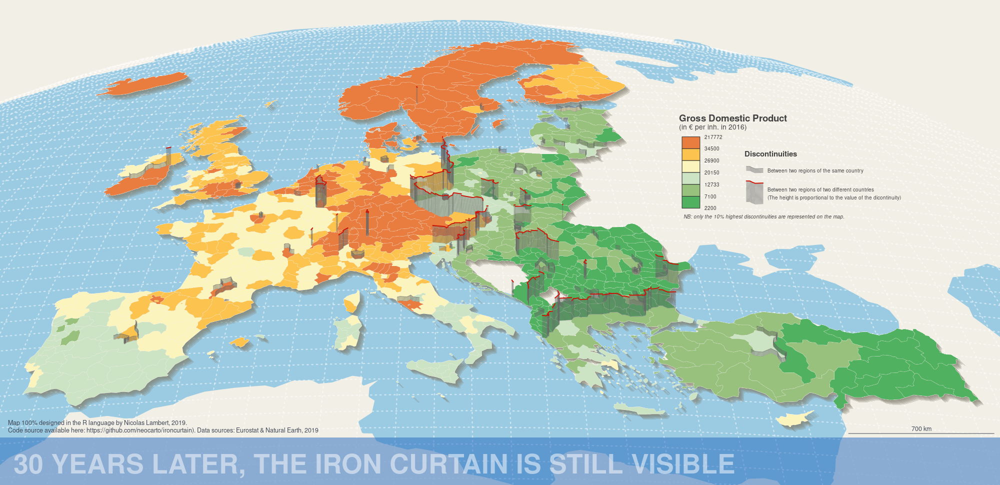
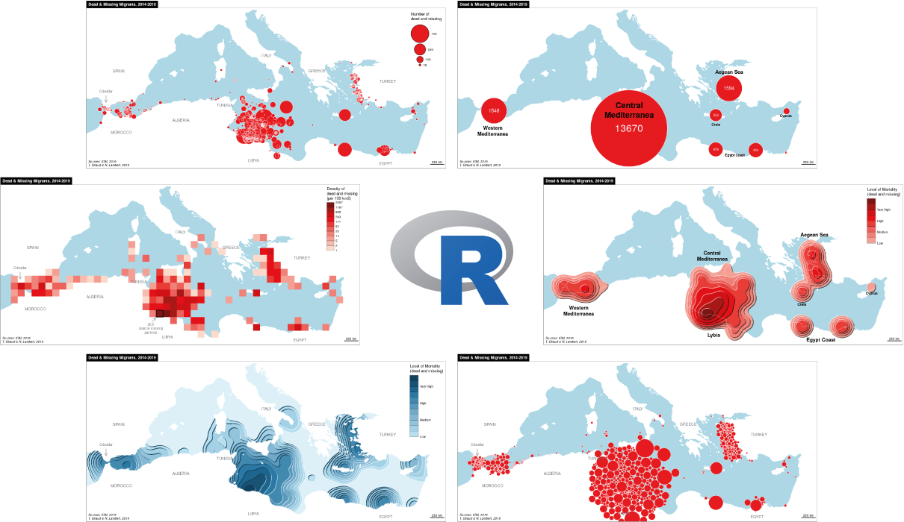

```{r setup, include=FALSE, cache=FALSE}
knitr::opts_chunk$set(
  echo = TRUE, 
  cache=TRUE, 
  fig.width = 8, 
  out.width="80%",
  fig.align="center"
)
```


# Research Context

A lab anchored in humanities with a focus on the dissemination of methods and tools for the analysis and representation of spatial information.   
https://riate.cnrs.fr/

## Tools 

### Regioviz

An app to visualize and compare regions

```{r, echo = FALSE, out.width="70%"}

```

https://riatelab.github.io/regioviz/

### Magrit

A thematic cartography software, on-line, open-source. 

```{r, echo = FALSE, out.width="70%"}

```


http://magrit.cnrs.fr

### R Packages

A set of R packages
osrm, potential, MTA...
github.com/riatelab

## Reproducible Research Promotion

### Rzine

A website to share R ressources for social sciences

```{r, echo = FALSE, out.width="70%"}

```

https://rzine.fr/

### SIGR

A summer school on Reproducible Research for Geographic Information Sciences

```{r, echo = FALSE, out.width="70%"}

```

https://sigr2021.github.io/site/


# Reproducible Cartography


## Why?


Maps, as other graphics or statistical outputs, are part of scientific studies. 
```{r, echo = FALSE, out.width="50%"}
knitr::include_graphics("img/maparticle.jpg")
```


Many maps produced in an academic context are made with a set of software products (spreadsheet, statistical software, GIS…) that slices the cartographic process. 
```{r, echo = FALSE}
knitr::include_graphics("img/chain2.png")
```
This multiplicity of tools and formats is an impediment to reproducibility. 


## How?

A fully reproducible map should be associated to the code and data used to produce it. 
```{r, echo = FALSE, fig.cap="@giraudlambert"}
knitr::include_graphics("img/giraudlambert.png", dpi=96)
```


### With R and its spatial ecosystem !

Simplify the map making process in an unified workflow. 

```{r, echo = FALSE, out.width="1000px"}
knitr::include_graphics("img/chain4.png")
```


### `sf`, corner stone of the R spatial ecosystem


```{r, echo = FALSE, fig.cap="@pebesma"}
knitr::include_graphics("img/sf_deps.png")
```


# `mapsf`

```{r, echo = FALSE, out.width="100%", fig.cap="typical workflow"}
knitr::include_graphics("img/workflow.png")
```


## `mf_map()`

[`mf_map()`](https://riatelab.github.io/mapsf/reference/mf_map.html) is the main function of the package.

```r
mf_map(x = objet_sf,
       var = "variable",
       type = "map type",
       ...)
```


```{r, echo = FALSE, out.width="100%", fig.cap="?mapsf"}

```


## 9 map types 

Vignette : [Get started](https://riatelab.github.io/mapsf/articles/mapsf.html#symbology)


```{r, echo = FALSE, out.width="657px"}

```


## Map mayout

```{r, echo = FALSE, out.width="80%"}

```


## Example


* Base map: 

<div class="row">
<div class="col-md-7" markdown="1">
```{r, results='hide', message = FALSE, echo = FALSE}
library(mapsf)
```
```{r ax, eval=FALSE}
mtq <- mf_get_mtq()
# Plot the base map
mf_map(x = mtq)
```
</div>
<div class="col-md-5" markdown="1">
```{r ax, message = FALSE, results='hide', fig.width = 5, fig.height=5, eval=TRUE, echo=FALSE, cache = TRUE}
```
</div>
</div>

* Choropleth map with default parameters: 

<div class="row">
<div class="col-md-7" markdown="1">
```{r a, eval=FALSE,  highlight.output=c(1, 3)}
mtq <- mf_get_mtq()
# Plot a choropleth map
mf_map(x = mtq, var = "MED", type = "choro")
```

</div>
<div class="col-md-5" markdown="1">

```{r a, message = FALSE, results='hide', fig.width = 5, fig.height=5, eval=TRUE, echo=FALSE}
```
</div>
</div>

* Parameters customisation:

<div class="row">
<div class="col-md-7" markdown="1">
```{r b, eval=FALSE}
mtq <- mf_get_mtq()
# Plot a choropleth map
mf_map(x = mtq, var = "MED", type = "choro",
       pal = "Dark Mint",
       breaks = "quantile",
       nbreaks = 6,
       leg_title = "Median Income\n(euros)",
       leg_val_rnd = -2,
       leg_pos = "topright")
```
</div>
<div class="col-md-5" markdown="1">
```{r b, message = FALSE, results='hide', fig.width = 5, fig.height=5, eval=TRUE, echo=FALSE}
```
</div>
</div>


* Map layout:

<div class="row">
<div class="col-md-7" markdown="1">
```{r c, eval=FALSE}
mtq <- mf_get_mtq()
# Plot a choropleth map
mf_map(x = mtq, var = "MED", type = "choro",
       pal = "Dark Mint",
       breaks = "quantile",
       nbreaks = 6,
       leg_title = "Median Income\n(euros)",
       leg_val_rnd = -2,
       leg_pos = "topright")
# Plot a layout elements
mf_title("Wealth in Martinique, 2015")
mf_credits("T. Giraud\nSources: INSEE & IGN, 2018")
mf_scale(size = 5)
mf_arrow('topleft')
```
</div>
<div class="col-md-5" markdown="1">
```{r c, message = FALSE, results='hide', fig.width = 5, fig.height=5, eval=TRUE, echo=FALSE}
```
</div>
</div>


* Theme:

<div class="row">
<div class="col-md-7" markdown="1">
```{r d, eval=FALSE}
mtq <- mf_get_mtq()
# Start a map using a theme
mf_init(x = mtq, theme = "dark")
# Plot a choropleth map
mf_map(x = mtq, var = "MED", type = "choro",
       pal = "Dark Mint",
       breaks = "quantile",
       nbreaks = 6,
       leg_title = "Median Income\n(euros)",
       leg_val_rnd = -2,
       leg_pos = "topright",
       add = TRUE)
# Plot a layout elements
mf_title("Wealth in Martinique, 2015")
mf_credits("T. Giraud\nSources: INSEE & IGN, 2018")
mf_scale(size = 5)
mf_arrow('topleft')
```
</div>
<div class="col-md-5" markdown="1">

```{r d, message = FALSE, results='hide', fig.width = 5, fig.height=5, eval=TRUE, echo=FALSE}
```
</div>
</div>


* Shadow:

<div class="row">
<div class="col-md-7" markdown="1">
```{r e, eval=FALSE}
mtq <- mf_get_mtq()
# Start a map using a theme
mf_init(x = mtq, theme = "dark")
# Plot a shadow
mf_shadow(mtq, col = "grey10", add = TRUE)
# Plot a choropleth map
mf_map(x = mtq, var = "MED", type = "choro",
       pal = "Dark Mint",
       breaks = "quantile",
       nbreaks = 6,
       leg_title = "Median Income\n(euros)",
       leg_val_rnd = -2,
       leg_pos = "topright",
       add = TRUE)
# Plot a layout elements
mf_title("Wealth in Martinique, 2015")
mf_credits("T. Giraud\nSources: INSEE & IGN, 2018")
mf_scale(size = 5)
mf_arrow('topleft')
```
</div>
<div class="col-md-5" markdown="1">
```{r e, message = FALSE, results='hide', fig.width = 5, fig.height=5, eval=TRUE, echo=FALSE}
```
</div>
</div>


* Inset

<div class="row">
<div class="col-md-7" markdown="1">
```{r f, eval=FALSE}
mtq <- mf_get_mtq()
# Start a map using a theme
mf_init(x = mtq, theme = "dark")
# Plot a shadow
mf_shadow(mtq, col = "grey10", add = TRUE)
# Plot a choropleth map
mf_map(x = mtq, var = "MED", type = "choro",
       pal = "Dark Mint",
       breaks = "quantile",
       nbreaks = 6,
       leg_title = "Median Income\n(euros)",
       leg_val_rnd = -2,
       leg_pos = "topright",
       add = TRUE)
# Add an inset world map
mf_inset_on(x = "worldmap", pos = "right")
mf_worldmap(mtq, col = "#0E3F5C")
mf_inset_off()
# Plot a layout elements
mf_title("Wealth in Martinique, 2015")
mf_credits("T. Giraud\nSources: INSEE & IGN, 2018")
mf_scale(size = 5)
mf_arrow('topleft')
```
</div>
<div class="col-md-5" markdown="1">
```{r f, message = FALSE, results='hide', fig.width = 5, fig.height=5, eval=TRUE, echo=FALSE}
```
</div>
</div>


* Extanded margins

<div class="row">
<div class="col-md-7" markdown="1">
```{r g, eval=FALSE}
mtq <- mf_get_mtq()
# Start a map using a theme and extra margins
mf_init(x = mtq, theme = "dark",
        expandBB = c(0,0,0,.3))
# Plot a shadow
mf_shadow(mtq, col = "grey10", add = TRUE)
# Plot a choropleth map
mf_map(x = mtq, var = "MED", type = "choro",
       pal = "Dark Mint",
       breaks = "quantile",
       nbreaks = 6,
       leg_title = "Median Income\n(euros)",
       leg_val_rnd = -2,
       leg_pos = "topright",
       add = TRUE)
# Add an inset world map
mf_inset_on(x = "worldmap", pos = "right")
mf_worldmap(mtq, col = "#0E3F5C")
mf_inset_off()
# Plot a layout elements
mf_title("Wealth in Martinique, 2015")
mf_credits("T. Giraud\nSources: INSEE & IGN, 2018")
mf_scale(size = 5)
mf_arrow('topleft')


```
</div>
<div class="col-md-5" markdown="1">
```{r g, message = FALSE, results='hide', fig.width = 5, fig.height=5, eval=TRUE, echo=FALSE}
```
</div>
</div>


## Insets


Vignette : [How to Create Inset Maps](https://riatelab.github.io/mapsf/articles/web_only/how_to_create_inset_maps.html) 


```{r set, echo = FALSE, cache=FALSE}
mf_theme("default", mar = c(0,0,0,0), bg = "white")
```


* With a geographic object

<div class="row">
<div class="col-md-5" markdown="1">
```{r carton1, eval = FALSE}
mf_map(mtq)
mf_inset_on(x = mtq[1, ], 
            cex = .3)
mf_map(mtq[1, ])
mf_inset_off()

```
<br><br><br><br><br><br><br><br>
</div>
<div class="col-md-5" markdown="1">
```{r carton1, eval = TRUE, echo = FALSE,  fig.width= 5, fig.height = 6, message = FALSE, results='hide'}
```
</div>
</div>


* Location inset

<div class="row">
<div class="col-md-5" markdown="1">
```{r carton2, eval = FALSE}

mf_map(mtq)
mf_inset_on(x = "worldmap", 
            pos = "bottomleft")
mf_worldmap(x = mtq)
mf_inset_off()
```
<br><br><br><br><br><br><br><br>
</div>
<div class="col-md-5" markdown="1">
```{r carton2, eval = TRUE, echo = FALSE, fig.width= 5, fig.height = 6, message = FALSE, results='hide'}
```

</div>
</div>

* Non-cartographic inset
```{r bee, results = FALSE, eval = FALSE}
library(mapsf)
library(beeswarm)
mtq <- mf_get_mtq()
# create classes
bks <- mf_get_breaks(x = mtq$MED, nbreaks = 4, 
                     breaks = "quantile") 
bks <- round(bks, digits = -2)
# define a color palette
pal <- hcl.colors(n = 4, palette = "Burg", rev = TRUE)
# set a theme
mf_theme("candy")
mf_export(x = mtq, filename = "img/insetbee.svg",
          export = "svg", 
          width = 7,theme = "candy")
fg <-mf_theme()$fg
# Create the map
mf_map(x = mtq, var = "MED", type = "choro",
       pal = pal, breaks = bks, leg_pos = NA)
# start the inset
mf_inset_on( fig = c(0.6, .99, 0.86, .99))
# draw the histogram
par(mar = c(0,0,1.7,0))
beeswarm(mtq$MED, vertical = FALSE, cex =1.2, 
         spacing = .95, axes = FALSE, 
         pwcol = pal[findInterval(mtq$MED, bks)], 
         ylim = c(-1,3), pch = 20)
axis(side = 1, at = bks, las = 2, tick = FALSE, 
     line = -1, cex.axis = .7, col.axis = fg)
abline(v=bks, lwd = .5, lty = 3, col = fg)
title("Median Income\nin euros", cex.main = .8, 
      col.main = fg, font.main = 1, adj = 0)
# close the inset
mf_inset_off()
# Add map layout
mf_title("Wealth in Martinique, 2015", pos = "left")
mf_scale(5)
mf_credits(paste0("Sources: Insee and IGN, 2018\n",
                  "mapsf ", packageVersion("mapsf")))
dev.off()
```


```{r, echo = FALSE, out.width="70%"}

```


## Themes 

Vignette : [How to Use Themes](https://riatelab.github.io/mapsf/articles/web_only/how_to_use_themes.html) 

```{r, message = FALSE, results='hide', echo = FALSE, fig.height=8, fig.width = 7}
par(mfrow = c(3,3))
mf_theme("default")
mf_map(mtq)
mf_title("default")

mf_theme("jsk")
mf_map(mtq)
mf_title("jsk")

mf_theme("green")
mf_map(mtq)
mf_title("green")

mf_theme("darkula")
mf_map(mtq)
mf_title("darkula")

mf_theme("ink")
mf_map(mtq)
mf_title("ink")

mf_theme("candy")
mf_map(mtq)
mf_title("candy")

mf_theme("dark")
mf_map(mtq)
mf_title("dark")

mf_theme("nevermind")
mf_map(mtq)
mf_title("nevermind")

mf_theme(bg = "#aad3df", fg = "#393939", mar = c(0,0,0,0),
         tab = TRUE, inner = TRUE, line = 1.3, pos = "center",
         cex = 1.1, font = 3)
mf_map(mtq)
mf_title("Custom")


```


## Raster 

<div class="row">
<div class="col-md-7" markdown="1">
```{r raster1, message = FALSE, results='hide', eval=FALSE, echo=TRUE}
library(maptiles)
mtq <- st_transform(mtq, 3857)
osm <- get_tiles(
  mtq, 
  provider = "Stamen.TerrainBackground", 
  crop= TRUE, 
  zoom = 11
)
th <- mf_theme(
  x = "default", bg = "#99b3cc", 
  inner = TRUE, line = 1.5, cex = 1, 
  pos = "right", mar = c(0,0,0,0)
)
mf_export(x = osm, filename = "img/osm.png", 
          width = 672, theme = th, res = 150)
mf_raster(osm)
mf_map(mtq, col = NA, add = TRUE)
mf_scale()
mf_title("mf_raster()")
mf_credits(get_credit("Stamen.TerrainBackground"))
dev.off()

```

</div>
<div class="col-md-5" markdown="1">
```{r, echo = FALSE}
knitr::include_graphics("img/osm.png")
```
</div>
</div>


## Documentation 

* A [website](https://riatelab.github.io/mapsf/)
```{r, echo = FALSE, out.width="1100px"}
knitr::include_graphics("img/websitev.png")
```

* A ['Get started'](https://riatelab.github.io/mapsf/articles/mapsf.html) vignette.


* 'How to' vignettes: 

  - [How to create faceted maps](https://riatelab.github.io/mapsf/articles/web_only/how_to_create_faceted_maps.html)
  - [How to create inset maps](https://riatelab.github.io/mapsf/articles/web_only/how_to_create_inset_maps.html)
  - [How to export maps](https://riatelab.github.io/mapsf/articles/mapsf.html)
  - [How to use a custom font family](https://riatelab.github.io/mapsf/articles/web_only/how_to_use_a_custom_font_family.html)
  - [How to use themes](https://riatelab.github.io/mapsf/articles/web_only/how_to_use_themes.html)

* A [cheat sheet](https://raw.githubusercontent.com/riatelab/mapsf/master/vignettes/web_only/img/mapsf_cheatsheet.pdf)

```{r, echo = FALSE, out.width="1100px"}
knitr::include_graphics("img/mapsf_cheatsheet.png")
```


## Development 

A minimal number of well-known dependancies: 


```{r, echo = FALSE, eval = FALSE, results='hide'}
library(deepdep)
dep <- deepdep("mapsf", depth = 6)
png("img/deps.png", width  = 600, height = 450)
plot_dependencies(dep, "circular", same_level = TRUE, reverse = TRUE, main = 'toto')
dev.off()

```
<center>

</center>


- CI/CD with [GitHub Actions](https://github.com/riatelab/mapsf/actions)

- Tests with `tinytest`, coverage with [Codecov](https://app.codecov.io/gh/riatelab/mapsf)

- Informative commit messages with [conventional commits](https://www.conventionalcommits.org/en/v1.0.0-beta.3/)


[](https://CRAN.R-project.org/package=mapsf)
[](https://github.com/riatelab/mapsf)

# Other packages


## `tanaka`

Also called "relief contours method", "illuminated contour method" or "shaded contour lines method", the Tanaka method enhances the representation of topography on a map by using shaded contour lines. The result is a 3D-like map.  

This package is a simplified implementation of the Tanaka method, north-west white contours represent illuminated topography and south-east black contours represent shaded topography. 


```{r tan1, eval = TRUE, message=FALSE, fig.show='hold'}
library(tanaka)
library(elevatr)
# use elevatr to get elevation data
ras <- get_elev_raster(
  locations = data.frame(x = c(6.7, 7), y = c(45.8,46)),
  z = 10, prj = "EPSG:4326", clip = "locations"
)
# display the map
opar <- par(mar = c(0,3,0,0))
tanaka(x = ras, breaks = seq(500,4800,250), 
       col = hcl.colors(18,"Inferno"))
par(opar)
```


Tanaka also can be used with non-topographical data:
```{r, echo = FALSE, out.width="800px"}

```

[](https://CRAN.R-project.org/package=tanaka)
[](https://github.com/riatelab/tanaka)

## `linemap`

`linemap()` displays a map made of lines using a data frame of gridded data. 

```{r lnmap, eval = FALSE, message=FALSE, fig.show='hold'}
library(linemap)
library(mapsf)
data("popOcc")
occitanie <- st_read(system.file("gpkg/geofla.gpkg", 
                                 package = "linemap"), 
                     layer = "Occitanie")
th <- mf_theme(bg = "ivory2")
mf_export(occitanie, width = 800, filename = "img/linemap.png")
mf_map(occitanie, col="ivory1", border = NA)
linemap(x = popOcc, var = "pop", k = 3.25, threshold = 50,
        col = "ivory1", border = "ivory4", lwd = 0.6, add = TRUE)
mf_title("Population in Occitanie")
mf_credits("Gridded data 1 km, INSEE 2010")
dev.off()
```


```{r, echo = FALSE, out.width="800px"}

```

[](https://CRAN.R-project.org/package=linemap)
[](https://github.com/riatelab/linemap)


## `maptiles`

To create maps from tiles, `maptiles` downloads, composes and displays tiles from a large number of providers (e.g. OpenStreetMap, Stamen, Esri, CARTO, or Thunderforest).

```{r maptiles, eval=FALSE}
library(sf)
library(maptiles)
hop <- st_read("data/hospital.gpkg", layer = "hospital")
osm <- get_tiles(hop)
th <- mf_theme(mar = c(0,0,0,0), inner = TRUE, line = 2, cex = 1.8)
mf_export(osm, filename = "img/maptiles.png", 
          width = 768, theme = th)
mf_raster(osm, add = TRUE)
mf_map(hop, "capacity", "prop", 
       border = "grey", inches = .4,
       leg_title = "Number of beds", 
       leg_frame = TRUE)
mf_title("Public Hospital Capacities in Paris")
mf_credits(get_credit("OpenStreetMap"), bg = "#ffffff80")
dev.off()
```


```{r, echo = FALSE, out.width="768px"}

```


The following figure shows mini maps for most of the tiles providers available:
```{r, echo = FALSE, out.width="840px"}
knitr::include_graphics("img/maptilesex.png")
```


[](https://CRAN.R-project.org/package=maptiles)
[](https://github.com/riatelab/maptiles)


## `popcircle`

This one-function package computes circles with areas scaled to a variable and displays them using a compact layout (higher values in the center, lower values at the periphery). Original polygons are scaled to fit inside these circles (size are roughly proportional, not strictly).


```{r, echo = FALSE, out.width="800px"}

```


[](https://github.com/rcarto/popcircle)

## `spikemap`

It is possible to map quantities with circles, squares or other simple geometric symbols, `spikemap` uses spikes.

```{r spike1, eval=TRUE, width=8}
library(sf)
library(spikemap)
library(mapsf)
# import the dataset from the package
com <- st_read(system.file("gpkg/com.gpkg", package="spikemap"), 
               quiet = TRUE)
mf_map(com, lwd =.2)
spikemap(x = com, var = "pop")
```


```{r spike, eval=FALSE, echo=FALSE}
library(sf)
library(spikemap)
library(mapsf)

# import the dataset from the package
com <- st_read(system.file("gpkg/com.gpkg", package="spikemap"))

# set theme
th <- mf_theme(mar = c(0.2,0.2,0.2,0.2), bg = "#e1e5eb")
# save figure as spiky.png in img folder
mf_export(com, filename = "img/spiky.png", width = 800, 
          expandBB = c(0,0,.1,0), theme = th)

# plot the base map
mf_map(com, col="#99aed1", border = "#e1e5eb", lwd = 0.2)

# display spikes for municipalities under 1000 inhabitants.
# use fixmax arg to allow multiple spike plots with the same scale.
spikemap(x = com[com$pop<=1000, ], var = "pop",
         inches = 2, fixmax = 500000,
         col = "#ffffff90", border = "#94000090",  lwd = .5,
         legend.pos = "x")
# display spikes for other municipalities
# use locator() to pick a place for the legend or use "bottomleft".
spikemap(x = com[com$pop>1000, ], var = "pop",
         inches = 2, fixmax = 500000,
         col = "#ffffff", border = "#940000", lwd = 1.1,
         legend.pos = c(779307.2, 6120000),
         legend.title.txt = "Population",
         legend.values.rnd = -3)

# get the tips of the spikes
lbl <- spikelabel(x = com, var = "pop",
                  inches = 2, fixmax = 500000)
lbl <- lbl[order(lbl$pop, decreasing = T),]
# display only the 12 first, use various cex and halo
mf_label(lbl[1:12,], var = "name",
           pos = 3, offset = .5,
           halo = T, bg = "#99aed150",
           cex = c(1.3, 1.1, 1, rep(.8,12)),
           col = "grey30")

# add scale bar, north arrow, title, sources...
mf_scale(size = 20, pos= c(629638.7 ,6126862.3 ), lwd = 1)
mf_arrow(pos = "topright", col = "grey60")
mf_title("Population in Occitanie", inner = TRUE, line = 1.7)
mf_credits(txt = paste0("ADMIN EXPRESS COG édition 2019, IGN\n",
                        "T. Giraud, 2021 | spikemap 0.1.0"))
dev.off()
```

```{r, echo = FALSE, out.width="800px"}

```


```{r, echo = FALSE, out.width="920px"}
knitr::include_graphics("img/fire.png")
```


[](https://github.com/rcarto/spikemap)


## more...

```{r, echo = FALSE, out.width="2000px", fig.cap="@lambert21"}

```

```{r, echo = FALSE, out.width="1210px", fig.cap="@Giraud_2019"}

```


```{r, echo = FALSE, out.width="1248px", fig.cap="@Le_Goix_2021"}
knitr::include_graphics("img/legoix.jpg")
```


# 

**Vielen Dank für Ihre Aufmerksamkeit**


  [rcarto.github.io/ifgi2021](https://rcarto.github.io/ifgi2021)  

  [\@rgeomatic](http://twitter.com/rgeomatic)


<details>
<summary>`sessionInfo()`</summary>
```{r test, echo=FALSE}
sessionInfo()
```
</details>


## References 

